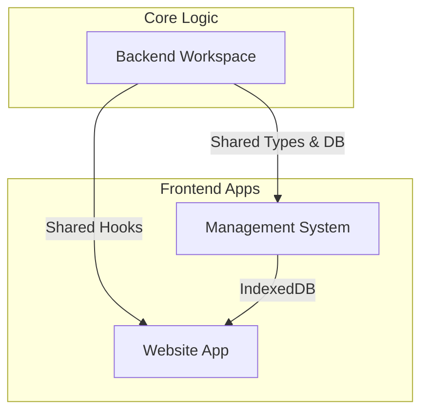

# 🥐 Mystery Bake Bite Monorepo

[](https://github.com/divinek/MysteryBakeBite)
[](LICENSE)

A high-performance, offline-first monorepo powering the **Mystery Bake Bite** ecosystem. This repository manages both the administrative operations and the customer-facing experience using a unified shared logic layer.

---

## 🏗 System Architecture

The project is structured as a **Turborepo-ready npm monorepo**, ensuring code reuse and type safety across all platforms.



### 📂 Workspaces

| Path                                                          | Name                     | Purpose                                                   |
| :------------------------------------------------------------ | :----------------------- | :-------------------------------------------------------- |
| [`/backend`](./backend)                                       | **Core Source of Truth** | Shared Dexie.js schemas, React hooks, and business logic. |
| [`/management-system-frontend`](./management-system-frontend) | **Admin Dashboard**      | Order management, inventory tracking, and recipe vault.   |
| [`/website-app-frontend`](./website-app-frontend)             | **Customer Experience**  | Public-facing menu and customer interaction.              |

---

## 🚀 Professional Setup

### 1. Prerequisites

- **Node.js**: v18.x or higher
- **npm**: v7.x or higher (for Workspace support)

### 2. Installation

Install dependencies for **all** workspaces from the root directory:

```bash
npm install
```

### 3. Development Workflow

We use a unified entry point to manage development servers:

- **Start Management System**: `npm run dev:admin` (or `./start.sh` option 1)
- **Start Website App**: `npm run dev:web` (or `./start.sh` option 2)
- **Start All**: `./start.sh` (option 3)

---

## 🔗 Shared Logic Layer (`@backend`)

All frontends consume shared logic via TypeScript path aliases. This ensures that any change to the database schema or business rules in `/backend` is automatically reflected across the entire ecosystem.

**Example Usage:**

```tsx
import { useOrders } from "@backend/lib/hooks";
import { db } from "@backend/lib/db";
```

---

## 🚢 Deployment (Vercel)

This monorepo is optimized for **Vercel** deployments.

1. **Management System**:
   - Root Directory: `management-system-frontend`
   - Framework Preset: `Vite`
2. **Website App**:
   - Root Directory: `website-app-frontend`
   - Framework Preset: `Vite`

> [!IMPORTANT]
> Ensure the "Include source files outside of the Root Directory" setting is enabled in Vercel to allow the apps to access the `/backend` folder.

---

## 🛠 Useful Utilities

- **`./push_to_github.sh`**: A premium CLI utility to synchronize all workspace changes with GitHub in one command.
- **`./start.sh`**: An interactive CLI to manage your local development environment.

---

## 📜 License

This project is Proprietary. All Rights Reserved. © 2026 Mystery Bake Bite.

---

_Created with ❤️ for Mystery Bake Bite_
