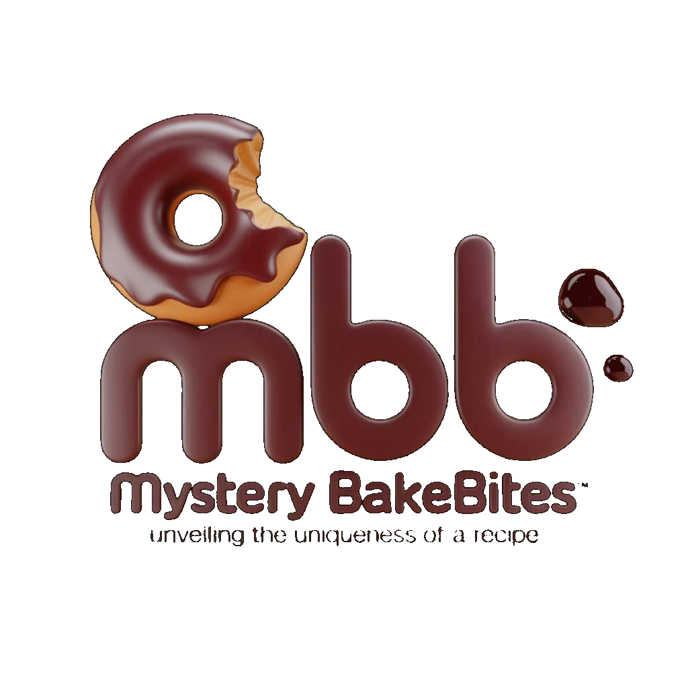

<div align="center">
  

# 🥐 Mystery Bake Bite

**Premium Bakery & Pastry Management Dashboard**

<br />


  
  <br />
  
  
  
  
</div>

<br />

## 🔒 Proprietary Notice.

This software is **Proprietary** and owned by **DivAmok Corp. ltd**. All rights are reserved. Unauthorized copying, modification, or redistribution of this software, via any medium, is strictly prohibited..

---

## 📖 Overview

**Mystery Bake Bite** is a bespoke, elegant, and highly responsive management dashboard tailored specifically for premium bakeries, pastry shops, and independent bakers. Engineered with a local-first philosophy, it allows business owners to manage their entire operation securely, offline, and blazing fast without relying on external cloud servers.

Designed with a stunning "glassmorphism" aesthetic, warm chocolate branding, and buttery smooth micro-animations, the app ensures that managing your business is as delightful as the treats you bake.

---

## 🌟 Why Mystery Bake Bite?

Most bakery software is built with sterile, generic interfaces that don't match the artisanal nature of baking. **Mystery Bake Bite** was created to bridge that gap—combining powerful, data-driven management tools with a UI that feels as warm and handcrafted as a fresh croissant.

- **Local-First Security**: Your secret recipes and customer data never leave your device.
- **Offline Reliability**: Manage your shop even when the internet goes down.
- **Performance**: Instant load times and zero-latency interactions.

---

## ✨ Core Features

### 📦 Order & Sales Management

Track every single order from placement to delivery. Features an intuitive order creation flow, auto-calculating totals, and an interactive reporting dashboard with dynamic date-range filtering to analyze sales performance.

### 🧁 Product Catalog (Bite)

Manage your menu items with ease. Upload photos per product, set dynamic pricing, categorize items (e.g., Pastries, Breads, Cakes), and write mouth-watering descriptions.

### 👥 Customer Directory (CRM)

Build lasting relationships. Keep a secure directory of all your customers, complete with contact details, order history, and custom notes to provide a personalized, VIP bakery experience.

### 📖 Secret Recipe Book

The heart of the bakery. Securely store your proprietary recipes, complete with detailed ingredient lists, step-by-step methods, and creation timestamps to protect your intellectual property.

### 🔧 Equipment Fleet

Keep the kitchen running flawlessly. Track your industrial ovens, mixers, and display cases. Monitor purchase dates, log maintenance records, and instantly see the operational status of every machine.

---

## 🛠 Tech Stack & Architecture

- **Frontend Framework**: [React](https://react.dev/) powered by [Vite](https://vitejs.dev/).
- **Language**: Strictly typed [TypeScript](https://www.typescriptlang.org/).
- **Styling**: [Tailwind CSS](https://tailwindcss.com/) with a custom design token system.
- **Database**: [Dexie.js](https://dexie.org/) (IndexedDB) for a local-first experience.

---

## 🚀 Getting Started

### Prerequisites

Make sure you have [Node.js](https://nodejs.org/) (v18+) installed.

### Installation

1. **Clone the repository**

   ```bash
   git clone https://github.com/DivAmok-Divine/mystery-bake-bite.git
   cd mystery-bake-bite
   ```

2. **Install dependencies**

   ```bash
   npm install
   ```

3. **Start the development server**

   ```bash
   npm run dev
   ```

4. **Open the App**
   Navigate to `http://localhost:5173` in your browser.

---

## 📄 License

This project is licensed under the **Proprietary Software License**. See the [LICENSE](LICENSE) file for details.

---

## 🎨 Design Philosophy

The UI was meticulously crafted to avoid the "sterile SaaS" look. By utilizing a cohesive color palette inspired by baking ingredients (deep chocolates, warm creams, and toasted doughs), layered translucency (glass effects), and carefully choreographed layout transitions, the software feels warm, tactile, and incredibly professional.
